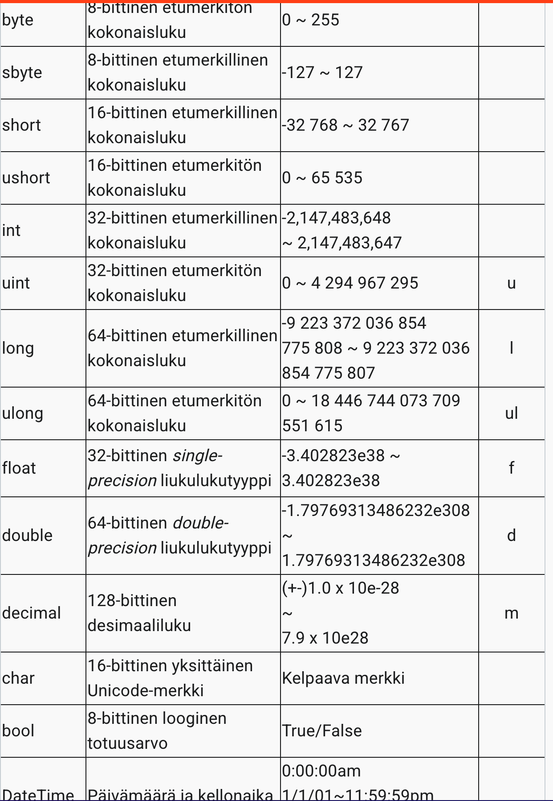

## Teoria muuttujat ja C# tyypit
- Tietokoneohjelmilla on usein tarve muistaa informaatiota. Tämä voidaan saavuttaa muuttujilla, tietynlaisilla muistivaraston yksiköillä.
- Operaattorit ovat merkkejä, joilla voidaan suorittaa erilaisia operaatioita operandeille (muuttujat ja/tai vakiot).
- C#-kielessä on kahta eri datatyyppiä: arvotyypit (value types) ja viitetyypit (reference types). Ero näiden välillä on se, että arvotyypit sisältävät niihin talletetun datan suoraan, kun taas viitetyyppeihin talletetaan viite dataan.
- Values types: (simple types: sbyte, ulong, short, char, int, float, long, double, byte, decimal, ushort, bool, uint) (enum types: enum E), (Tuple Value Types: T1, T2), (Struct types: struct S), (Nullable types: enum E)

- Reference types: (Class types: class C), (Interface Types: Interface I), (Array types: int[]), (Delegate Types: delegate int D)
